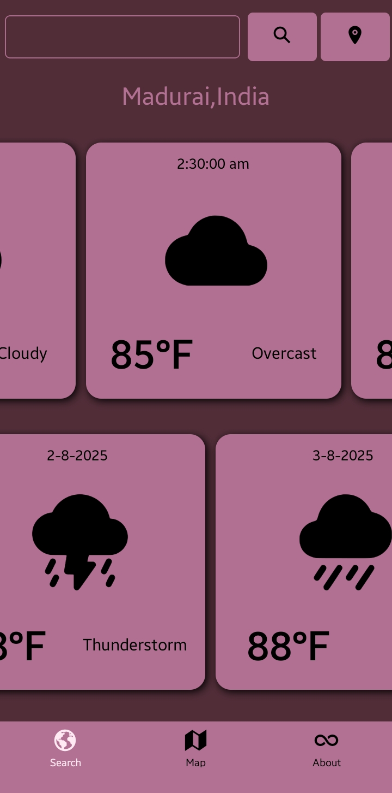
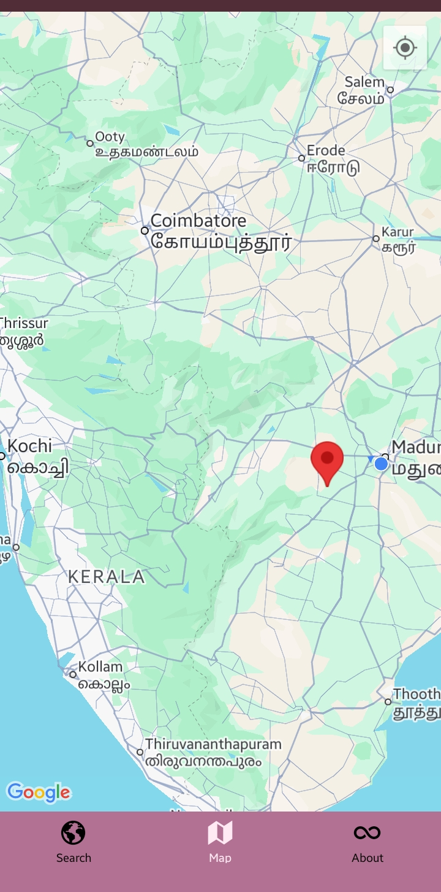

# Simple Weather App with Map 
A modern and intuitive mobile weather application built with React Native and Expo. This app provides real-time weather forecasts, allows users to search for locations, and offers an interactive map where you can select any region to view its current weather conditions.

## Features  
- [x] Hourly and 7 days weather forecasts.

- [x] Current Weather: Get up-to-date weather information for your current location or any searched city.

- [x] Location Search: Easily find weather forecasts for any city worldwide.

- [x] Interactive Map: Explore weather conditions by selecting any point on the map.

- [x] Detailed Forecast: View comprehensive weather details for selected locations.

- [x] User-Friendly Interface: Clean and responsive design for a seamless experience.

## Technologies Used  

- React Native
- Expo Router
- Expo Map
- Expo Location
- Open Meteo API
- Ionicons

## Installation
Go to release page https://github.com/KISHOREkevin/weather-app-react-native/releases and download the `weather.apk`.

## Contribution (Setup) 

1. **Clone the repository**  
   ```sh
   git clone https://github.com/KISHOREkevin/weather-app-react-native.git weather
   cd weather/
   ```
2. **Install dependencies**
    ```sh
    npm install
    ```
3. Run the App
    ```sh
    npx expo start
    ```

## ScreenShot




## Contributions

This project was made possible thanks to:
- [React Native Community](https://reactnative.dev/) 
- [Expo Community](https://github.com/expo/expo) 
- [Open Meteo](https://open-meteo.com/) 

Feel free to contribute by opening issues or pull requests!

## License
MIT © Kishore Kevin [License](https://github.com/KISHOREkevin/todoapp-react-native/blob/main/LICENSE)  

